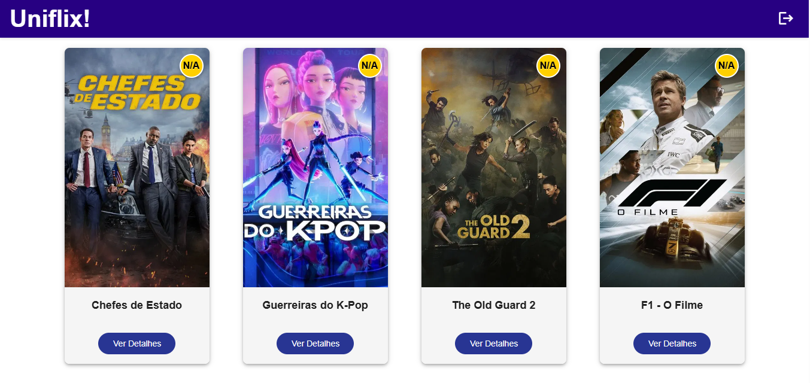
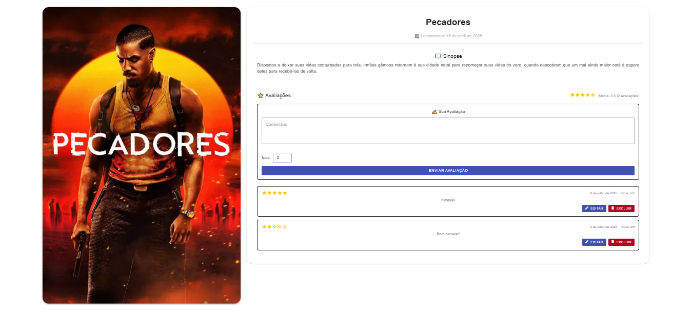

# 🎬 Uniflix

O **Uniflix** é um projeto desenvolvido para a disciplina de Programação Web (XDES03) da Universidade Federal de Itajubá – UNIFEI. Seu objetivo principal é **aproximar os alunos da universidade** por meio de um clube de filmes, criando conexões e promovendo amizades com base em gostos cinematográficos.

## 🌐 Objetivo

Muitos alunos, ao ingressarem na faculdade, enfrentam o desafio de estar longe de seus amigos e familiares. O Uniflix surge como uma solução para ajudar na socialização e construção de novas amizades através de um espaço digital que permite compartilhar opiniões, assistir recomendações e interagir com filmes em comum.

## 💡 Funcionalidades

- ✅ Tela de **Login** e **Cadastro de usuários**
- ✅ Validação de email, senha e campos obrigatórios
- ✅ Autenticação protegida com **Firebase**
- ✅ Página principal com **listagem de filmes**
- ✅ Cards com botão para detalhes e avaliações dos filmes
- ✅ Sistema de **CRUD de avaliações** (Criar, Ler, Atualizar, Deletar)
- ✅ Média das avaliações de cada filme
- ✅ Consumo de API externa (**The Movie Database API - TMDB**)
- ✅ ETL (Extract, Transform, Load) para popular o banco de dados
- ✅ Banco de dados no **Firebase Firestore**
- ✅ Design responsivo com **Vuetify**

## 🛠️ Tecnologias Utilizadas

### Frontend

- Vue 3
- Vite
- Vuetify
- Axios
- Firebase Authentication

### Backend

- Node.js
- Express.js
- Firebase Admin SDK

### Banco de Dados

- Firebase Firestore

### Outros

- ETL com arquivos separados em:
  - `etl/filmes`
  - `etl/generos`
  - `etl/avaliacoes`
  - `etl/usuarios`

## 🔁 CRUD Implementado

| Operação | Descrição                        |
| -------- | -------------------------------- |
| Create   | Cadastro de usuários e feedbacks |
| Read     | Listagem de filmes e avaliações  |
| Update   | Edição de notas das avaliações   |
| Delete   | Remoção de avaliações            |

## 🌍 API Externa

Utilizamos a **TMDB API** para buscar os filmes populares e armazená-los no Firebase via processo de ETL.

- Link da API: [https://www.themoviedb.org/](https://www.themoviedb.org/)

## 📝 Instalação e Execução

```bash
# Clonar o projeto
git clone https://github.com/RenanCarles/prog-web

# Instalar dependências (frontend)
cd crud
npm install
npm run serve

# Instalar dependências (backend)
cd back
npm install
node index.js

# Rodar o ETL (opcional)
cd ETL-DB/etl
npm install
node run.js
```

## 📌 Requisitos do Projeto (XDES03 - Programação Web)

- [x] Aplicação Web
- [x] Tela de login e cadastro
- [x] Validação de campos obrigatórios e email
- [x] Autenticação protegida
- [x] CRUD completo com POST/GET/PUT/DELETE
- [x] Utilização de API externa
- [x] Versionamento com Git
- [x] Documentação com README

## 📣 Contribuidores

- Fábio Augusto
- Renan Carles
- Luiz Gustavo

## 📸 Telas do Projeto

<sub>
<p align="center">
  
</p>

<p align="center">
  
</p>
</sub>

## 📚 Licença

Este projeto é apenas para fins educacionais.
